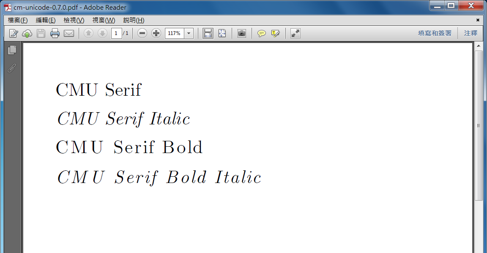
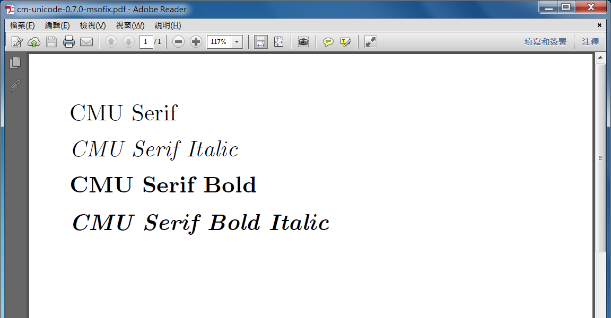

# cm-unicode-msofix
Computer Modern Unicode fonts with compatibility fix for Microsoft Word built-in PDF export function

[cm-unicode](https://sourceforge.net/projects/cm-unicode) was created by Andrey V. Panov.

## Patches
CMU bold fonts (e.g. CMU Serif Bold) cannot be correctly embedded when exporting to PDF by Microsoft Word. So the following patches are applied with [fonttools](https://github.com/fonttools/fonttools).

* Change the font weight of Normal style (e.g. CMU Serif) from `Medium (500)` to `Regular (400)`. This basically fixes the problem.
* Change the Subfamily name of some fonts from `Medium` to `Roman`. This is not necessary but applied for consistency.
* Fonts with no changes are also recompiled because I am lazy.

## Screenshots
### cm-unicode 0.7.0

### cm-unicode 0.7.0-msofix

